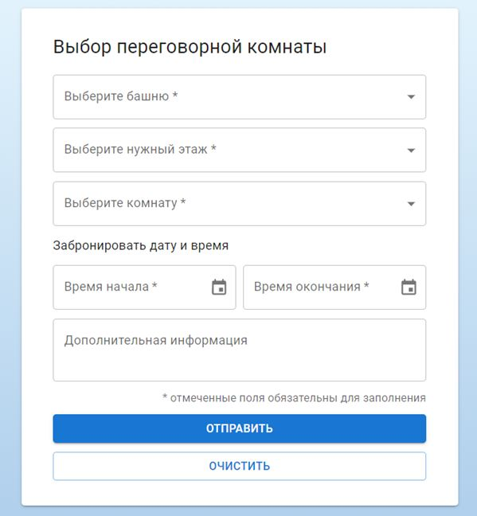

# Форма бронирования переговорной комнаты

## [Demo](https://devmikealex.github.io/Room-reservation/dist/)

## Особенности

Форма для бронирования содержит следующие элементы:
- Выпадающий список с выбором башни (А или Б) - *обязательное поле*
- Выпадающий список с выбором этажа (с 3 по 27) - *обязательное поле*
- Выпадающий список с выбором комнаты. На каждом этаже 10 комнат - *обязательное поле*
- Выбор даты и времени - *обязательные поля*
- Поле ввода дополнительного комментария
- Кнопка "**Отправить**"
  - по нажатию выводит в консоль данные формы в виде json
  - дополнительно информация отображается под формой
- Кнопка "**Очистить**"
- Валидация данных формы выполнена средствами браузера
- Присутствует легкая адаптивность в верстке

## Технологии проекта

- React
- TypeScript
- Material UI
